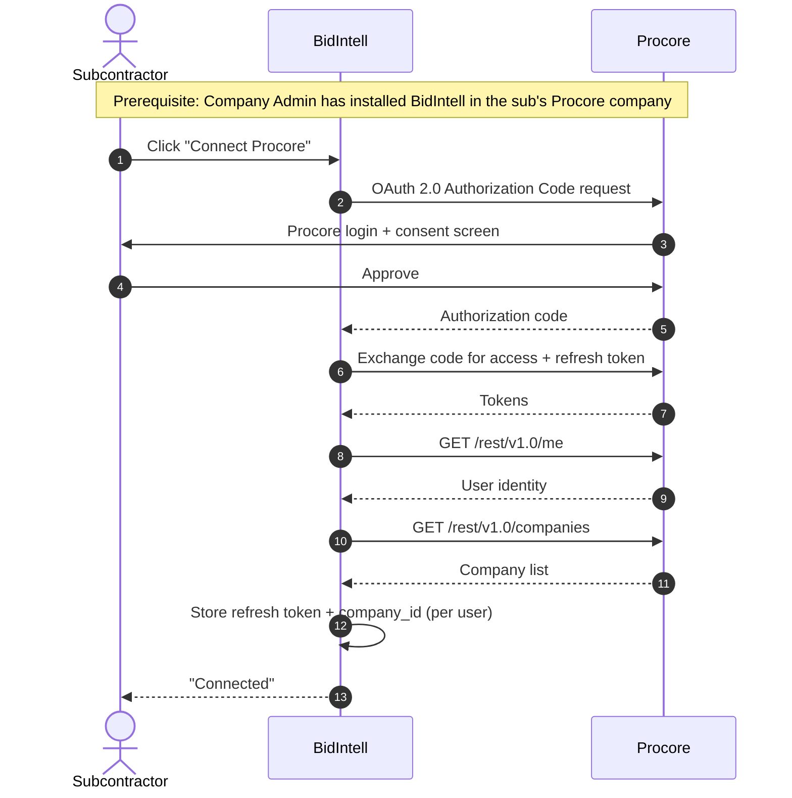
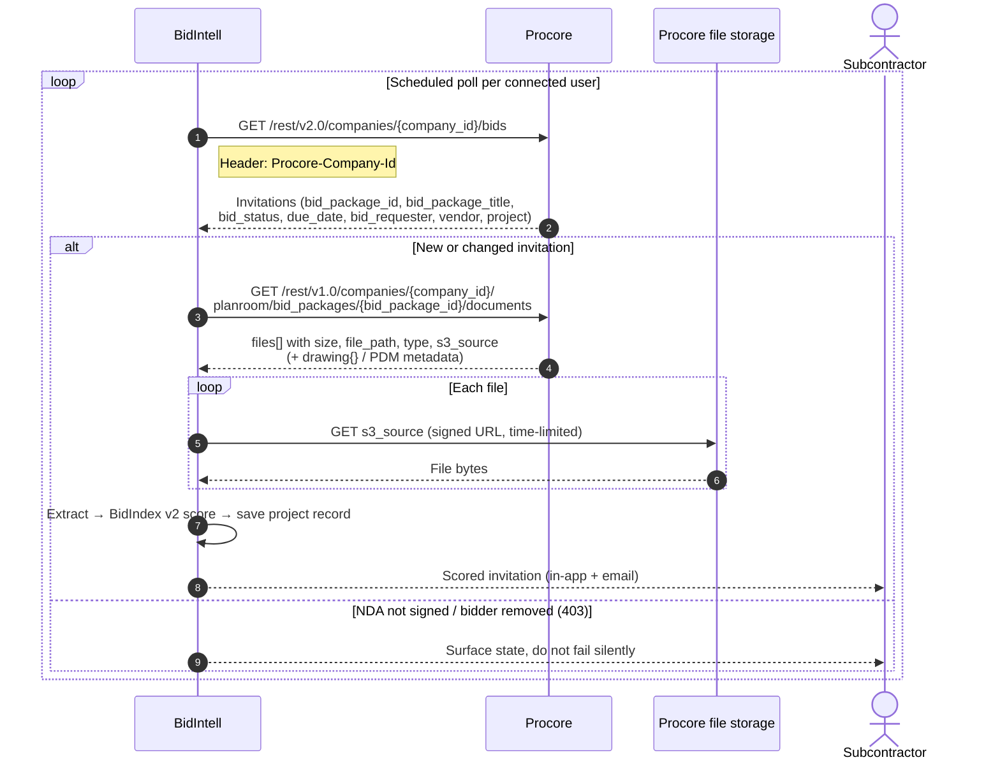
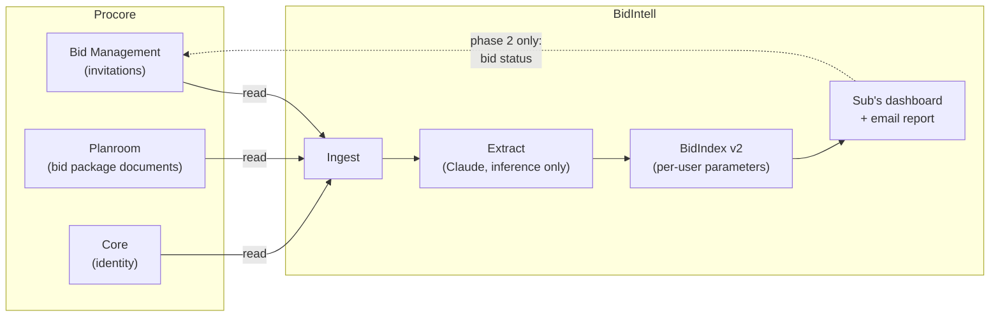

# BidIntell × Procore — Integration Workflow Diagram

**Deliverable for:** Procore Technology Partner — Technical Feasibility phase
**Status:** Proposed integration (Discovery / Planning — no Procore app created yet)
**Endpoint feasibility:** verified against the REST reference Aug 7 2026 — see `PROCORE_INTEGRATION_SPEC.md` §3
**Direction:** Read-only in v1. One write in a clearly-labelled phase 2.

> Render the Mermaid blocks below (mermaid.live, Excalidraw, Lucidchart, or draw.io all
> import it) and export to match Procore's format example. The CRUD matrix in §4 is the part
> their form explicitly asks for — keep it on the diagram itself, not just in the appendix.

---

## 1. Systems and actors

| | |
|---|---|
| **Subcontractor (user)** | Receives bid invitations. BidIntell's customer. Holds a Procore account on which they are an invited bidder. |
| **Procore** | Bid Management / Planroom (the invitation + documents source) and Core (identity). |
| **BidIntell** | Scores each invitation 0–100 (BidIndex) with a GO / REVIEW / PASS recommendation, personalised to that sub's trades, territory, client history and logged outcomes. |

**Prerequisite (draw this explicitly — it is a real gate):** a Company Admin in the
subcontractor's Procore company must install the BidIntell app before any company-scoped call
succeeds. Until then calls return 401/403. See open item O-1.

---

## 2. Flow A — Connect (one-time, user-initiated)

**Why Authorization Code and not a service account** — a Developer Managed Service Account
cannot be added to more than one company directory, which is structurally wrong for
multi-tenant. More decisively, the invitations endpoint returns "*your assigned* Bids"; a
service-account identity has no bid assignments and may return an empty array even with
Bid Board permissions. Reasoning in full: spec §3e.

---

## 3. Flow B — Ingest and score (recurring)

**Trigger is polling, not webhooks.** Procore does expose `Bids` as a webhook resource, but
webhook subscriptions are created against a project and an invited bidder is not a project
member — so bidder-side webhook eligibility is unconfirmed (open item O-2). The application
said "API/webhooks"; **the diagram should say polling**, with webhooks noted as a future
optimisation. Do not draw a webhook arrow you cannot defend.

**`s3_source` URLs expire.** Fetch bytes immediately; never persist the URL. On expiry,
re-request the documents endpoint rather than retrying the stale link.

---

## 4. CRUD matrix — the part Procore's form asks for

| Procore module | Object | Endpoint | C | R | U | D |
|---|---|---|:-:|:-:|:-:|:-:|
| Core | Current user | `GET /rest/v1.0/me` | | ✅ | | |
| Core | Company | `GET /rest/v1.0/companies` | | ✅ | | |
| Bid Management | Bid (invitation received) | `GET /rest/v2.0/companies/{company_id}/bids` *(beta)* | | ✅ | | |
| Bid Management — Planroom | Bid Package Documents | `GET /rest/v1.0/companies/{company_id}/planroom/bid_packages/{bid_package_id}/documents` | | ✅ | | |
| File storage | File contents | `GET {s3_source}` (signed, time-limited) | | ✅ | | |
| **Phase 2 — not in v1** | Bid status write-back | `PATCH /rest/v1.1/companies/{company_id}/bids/{id}` | | | ⬜ | |

**v1 is read-only across every object.** No creates, no updates, no deletes, no bulk export,
no migration of Procore data to a separate system of record.

**Phase 2** would write the sub's decision (`will_bid` / `will_not_bid`) back so the GC sees
intent earlier — the outcome Procore's ecosystem actually benefits from. It reflects a
decision the user explicitly made in BidIntell; never an autonomous AI action.

---

## 5. Data flow directionality

Solid arrows = v1. Dashed = phase 2. **All v1 data movement is Procore → BidIntell.**

---

## 6. Explicitly out of scope

State these on the submission — scoping out honestly is the point of this phase.

- **No `planroom/bid_packages` list endpoint exists.** Package IDs are discovered only via
  `companies/{id}/bids`. Do not draw a package-listing call.
- **No documents API under `bid_board_projects`.** Files uploaded to a Bid Board project in
  the UI are not reachable.
- **`bids/{id}/uploads` is the bidder's own submitted files**, not the GC's documents. Not a
  document source; easy to misread.
- **Correspondence** exists only under `companies/{id}/bid_packages/{id}/correspondences` and
  is untested from the bidder side. Not in v1.
- No bulk data export. No permanent migration to a separate system of record. No autonomous
  writes anywhere.

---

## 7. Edge states — draw these as normal, not as failures

| State | Cause | Handling |
|---|---|---|
| Package contents unavailable | Sub hasn't signed the required NDA | Surface to the user with the reason; score metadata-only |
| 403 / package vanishes | Solicitor removed the bidder | Mark the record stale; do not alert as an error |
| Expired `s3_source` | Signed URL is time-limited | Re-request the documents endpoint; never retry the stale URL |
| Partial pagination | `pdm_*` query params page the PDM slice only, **not** drawings | Handle the two collections separately |
| 401 / 403 on every call | App not installed in the customer's company | Prompt the admin install; distinguish clearly from an auth expiry |

Given BidIntell's July 2026 silent-failure incident, each of these needs an explicit branch —
not a catch block that logs and continues.

---

## 8. Open items to resolve before or alongside submission

| # | Item | Why it matters |
|---|---|---|
| **O-1** | Can a **free-tier** Procore company install a Marketplace app? | Decides whether the reachable base is every Procore-invited sub or only paying ones. Question 1 in the spec §8 email. |
| **O-2** | Can a **bidder** subscribe to `Bids` webhooks, or is polling the only trigger? | Determines the diagram's trigger arrow and whether the application's "API/webhooks" wording needs correcting. |
| **O-3** | Required permission level for the authorizing user | Assumed Read Only or higher on Planroom / Bid Board; not documented on either reference page. |
| **O-4** | Beta stability / GA timeline for both primary endpoints | Both are beta with fields added through 2026. Pin version headers. |
| **O-5** | Confirm the radio answers in the submitted application | Especially "Is the integration Bi-Directional?" — this diagram says read-only v1, and the two must agree. |
