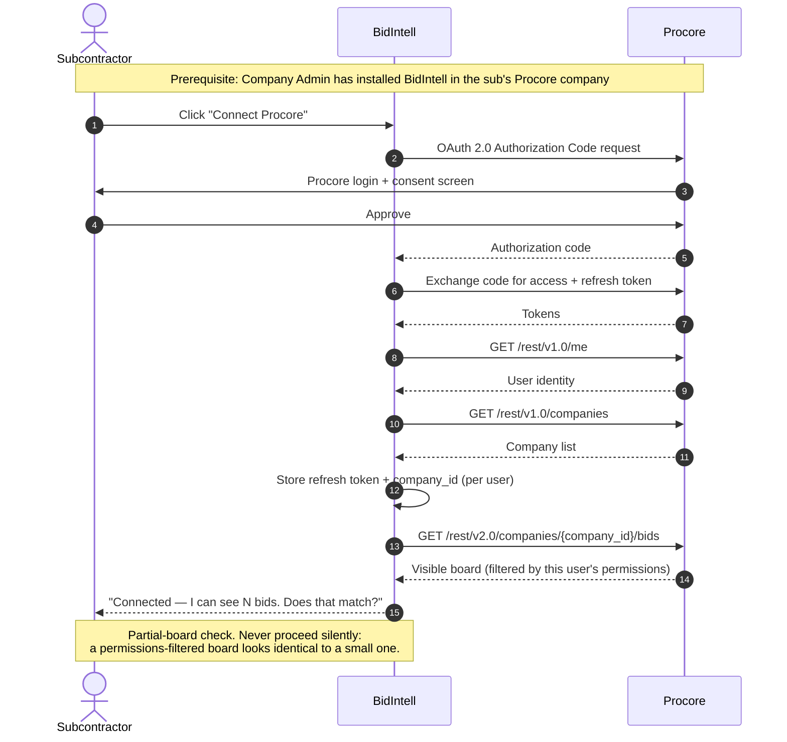
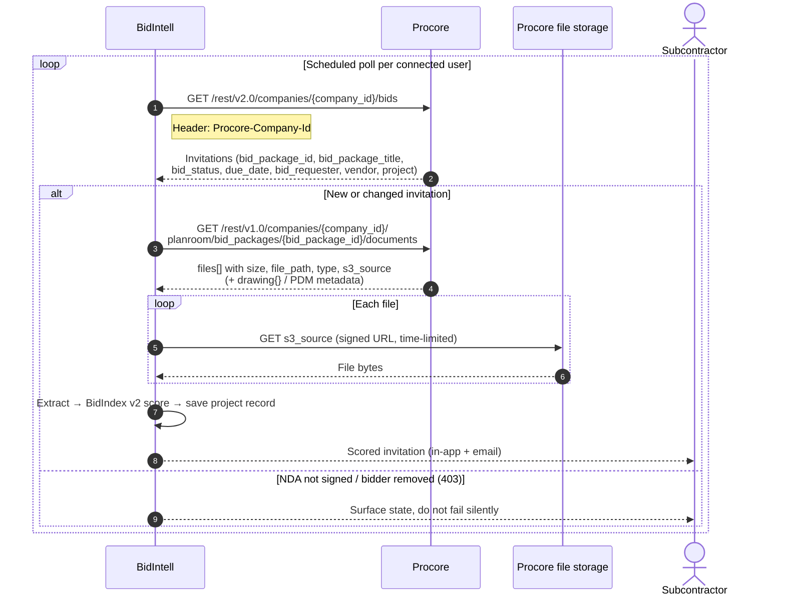
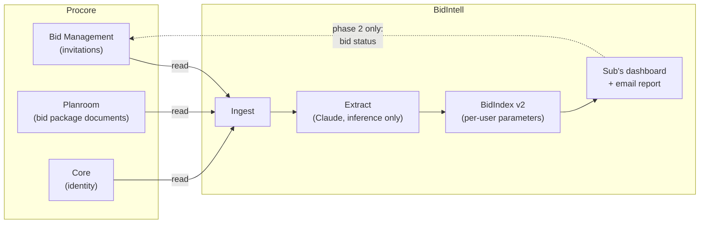

# BidIntell × Procore — Integration Workflow Diagram

**Deliverable for:** Procore Technology Partner — Technical Feasibility phase
**Status:** Proposed integration (Discovery / Planning — no Procore app created yet)
**Endpoint feasibility:** verified against the REST reference Aug 7 2026 — see `PROCORE_INTEGRATION_SPEC.md` §3
**Direction:** Read-only in v1. One write in a clearly-labelled phase 2.

> Render the Mermaid blocks below (mermaid.live, Excalidraw, Lucidchart, or draw.io all
> import it) and export to match Procore's format example. The CRUD matrix in §4 is the part
> their form explicitly asks for — keep it on the diagram itself, not just in the appendix.

---

## 1. Systems and actors

| | |
|---|---|
| **Subcontractor (user)** | Receives bid invitations. BidIntell's customer. Holds a Procore account on which they are an invited bidder. |
| **Procore** | Bid Management / Planroom (the invitation + documents source) and Core (identity). |
| **BidIntell** | Scores each invitation 0–100 (BidIndex) with a GO / REVIEW / PASS recommendation, personalised to that sub's trades, territory, client history and logged outcomes. |

**Two prerequisites (draw both — they are real gates, and they go in the same admin
conversation):**
1. A Company Admin must **install** the BidIntell app in the subcontractor's Procore company.
   Until then every company-scoped call returns 401/403. (O-1)
2. The authorizing user must have **Admin on Bid Board**, or `Can Access Projects for All
   Users` on their permission template. Without one of those, Read Only / Standard users see
   **only bids where they are the assigned Estimator** — a partial board returned with no
   error. (O-3)

---

## 2. Flow A — Connect (one-time, user-initiated)

**Why Authorization Code and not a service account** — a Developer Managed Service Account
cannot be added to more than one company directory, which is structurally wrong for
multi-tenant. More decisively, the invitations endpoint returns "*your assigned* Bids"; a
service-account identity has no bid assignments and may return an empty array even with
Bid Board permissions. Reasoning in full: spec §3e.

---

## 3. Flow B — Ingest and score (recurring)

**Trigger is polling, and webhooks cannot replace it.** `Bids` *is* available as a
**company-scoped** webhook resource — one row in Procore's webhook resources CSV: Project
Management / Bidding / company / Bids / v2 / **`except: create,delete`**. Procore fires
create, update and delete events; Bids excludes create and delete, leaving only `update`.

A new invitation is a *create*. **The one event we need is the one that doesn't fire.**
Webhooks may still be a useful supplement for change detection on bids we already know about
(`invitation_last_sent_at`, `due_date`), but they cannot be the discovery mechanism. Two
further nails: configuring company webhooks requires Admin on the company Admin tool — which
inherits the free-tier problem in O-1 entirely — and webhook event history is retained only
28 days, so they were never a backfill path either.

The application said "API/webhooks." **The diagram says polling**, and that is now a defended
position rather than an unverified one.

**No server-side filtering.** The endpoint takes only `page` and `per_page` — no `filters[]`,
despite Procore supporting it on many list actions. We cannot request open bids or a due-date
window; we page the **whole board** every cycle and filter client-side. Use each record's
`updated_at` for change detection.

**Rate budget:** 3,600 requests/hour per `client_id`, **shared across all tenants** — not per
customer. Combined with full-board paging, this is the real scaling constraint: model it
against projected tenant count before launch. Draw it — a platform reviewer will look for it.

**`s3_source` URLs expire.** Fetch bytes immediately; never persist the URL. On expiry,
re-request the documents endpoint rather than retrying the stale link.

---

## 4. CRUD matrix — the part Procore's form asks for

| Procore module | Object | Endpoint | C | R | U | D |
|---|---|---|:-:|:-:|:-:|:-:|
| Core | Current user | `GET /rest/v1.0/me` | | ✅ | | |
| Core | Company | `GET /rest/v1.0/companies` | | ✅ | | |
| Bid Management | Bid (invitation received) | `GET /rest/v2.0/companies/{company_id}/bids` *(beta)* | | ✅ | | |
| Bid Management — Planroom | Bid Package Documents | `GET /rest/v1.0/companies/{company_id}/planroom/bid_packages/{bid_package_id}/documents` | | ✅ | | |
| File storage | File contents | `GET {s3_source}` (signed, time-limited) | | ✅ | | |
| **Phase 2 — not in v1** | Bid status write-back | `PATCH /rest/v1.1/companies/{company_id}/bids/{id}` | | | ⬜ | |

**v1 is read-only across every object.** No creates, no updates, no deletes, no bulk export,
no migration of Procore data to a separate system of record.

**This matches the application exactly.** The submitted form answered **"No"** to *"Is the
proposed integration Bi-Directional (reading data from Procore and writing data back)?"*
(confirmed Aug 7 2026 via the Google Form "Edit response" view). The dashed phase-2 row is
not a contradiction — the application's own narrative already disclosed it as *"Future scope
(not in initial integration): Project Management — writing the sub's bid decision/status
back."* Keep the label unambiguous so a reviewer never has to reconcile the two.

**Phase 2** would write the sub's decision (`will_bid` / `will_not_bid`) back so the GC sees
intent earlier — the outcome Procore's ecosystem actually benefits from. It reflects a
decision the user explicitly made in BidIntell; never an autonomous AI action.

---

## 5. Data flow directionality

Solid arrows = v1. Dashed = phase 2. **All v1 data movement is Procore → BidIntell.**

---

## 6. Explicitly out of scope

State these on the submission — scoping out honestly is the point of this phase.

- **No `planroom/bid_packages` list endpoint exists.** Package IDs are discovered only via
  `companies/{id}/bids`. Do not draw a package-listing call.
- **No documents API under `bid_board_projects`.** Files uploaded to a Bid Board project in
  the UI are not reachable.
- **`bids/{id}/uploads` is the bidder's own submitted files**, not the GC's documents. Not a
  document source; easy to misread.
- **Correspondence** exists only under `companies/{id}/bid_packages/{id}/correspondences` and
  is untested from the bidder side. Not in v1.
- No bulk data export. No permanent migration to a separate system of record. No autonomous
  writes anywhere.

---

## 7. Edge states — draw these as normal, not as failures

| State | Cause | Handling |
|---|---|---|
| Package contents unavailable | Sub hasn't signed the required NDA | Surface to the user with the reason; score metadata-only |
| 403 / package vanishes | Solicitor removed the bidder | Mark the record stale; do not alert as an error |
| Expired `s3_source` | Signed URL is time-limited | Re-request the documents endpoint; never retry the stale URL |
| Partial pagination | `pdm_*` query params page the PDM slice only, **not** drawings | Handle the two collections separately |
| 401 / 403 on every call | App not installed in the customer's company | Prompt the admin install; distinguish clearly from an auth expiry |

Given BidIntell's July 2026 silent-failure incident, each of these needs an explicit branch —
not a catch block that logs and continues.

---

## 8. Open items to resolve before or alongside submission

| # | Item | Status |
|---|---|---|
| **O-1** | Can a **free-tier** Procore company install a Marketplace app? | ⏳ **OPEN, but the evidence is now one-sided — plan against it.** Install requires "'Admin' on the Company level **Directory** tool"; free accounts have no Directory tool. The free-account permissions matrix is a *complete enumeration* (General Account Management + Bid Board) and contains no app/integration/API action for any role, System Administrator included. User-installs were deprecated Jan 20 2026. Marketplace *approval* governs listing, not the tenant-side install gate. No document states it either way — ask `apisupport@procore.com` (spec §8). **If confirmed paid-only, the deck's ICP needs the rewrite in spec §4a.** |
| **O-2** | Webhooks vs polling | ✅ **RESOLVED — polling.** `Bids` is a company-scoped webhook resource but excludes `create`, so new invitations never fire an event. Useful only as a supplement for changes to known bids. Also requires company Admin (inherits O-1) and retains history 28 days. |
| **O-3** | Required permission for the authorizing user | 🚨 **REOPENED — and it's the biggest build risk.** Bid Contact gates *submission* only (correct), but the **visibility** gate is **Estimator assignment**: Read Only / Standard users see only bids they're the assigned Estimator on, unless they hold Admin on Bid Board or `Can Access Projects for All Users`. A partial board returns **with no error**. Requires a connect-time count check and a permission ask in onboarding. ⏳ Sub-question: English and localised permission docs disagree on whether *Standard* is constrained — decides the onboarding ask. Spec §3h. |
| **O-4** | Beta stability / GA timeline | ✅ **RESOLVED, and not as expected — there is no GA track to wait for.** Procore's published API Lifecycle defines only Active / Deprecated / Sunset; "Beta" and "GA" appear nowhere in it. The BETA tag sits outside the documented lifecycle: no promotion criteria, no committed notice before in-version breaking changes. Only durable guarantee is 1 year of support after deprecation. See spec §3f for what this means for the build. |
| **O-5** | Confirm the radio answers in the submitted application | ✅ **Bi-Directional = No** (confirmed Aug 7 2026). The diagram's read-only v1 agrees with the application. Remaining radios (bulk export, system-of-record migration) are almost certainly "No" too and consistent with this diagram — worth a glance, but nothing depends on them. |
